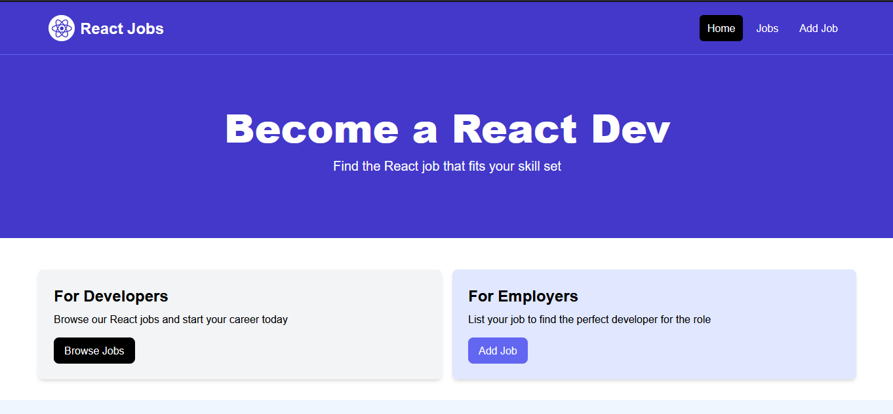

# Job Listing Website

This repository contains the source code for a **Job Listing Website** built using **React**. The application allows users to browse, search, and apply for jobs seamlessly, providing an intuitive user interface and an efficient job search experience.

## Features

- **User Authentication**
  - Secure Login and Registration pages.
  - Password encryption for secure access.

- **Job Listings**
  - Display all available job postings.
  - Filter and search jobs by title, location, skills, and company.

- **Job Details**
  - View detailed information about each job, including role requirements, responsibilities, and benefits.

- **Job Application**
  - Simple application process with file upload for resumes.

- **Admin Panel** (optional)
  - Add, update, or delete job listings.
  - Manage user accounts.

- **Responsive Design**
  - Mobile-friendly UI for seamless browsing across devices.

## Tech Stack

- **Frontend**: React, React Router, Axios
- **Styling**: CSS Modules
- **API Integration**: RESTful APIs for fetching job data
- **State Management**: React Context

## Screenshots

